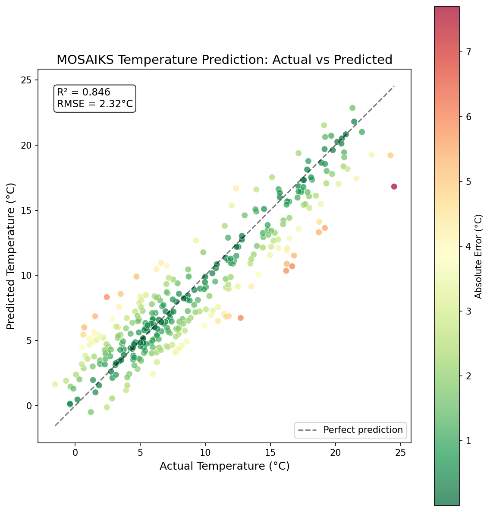
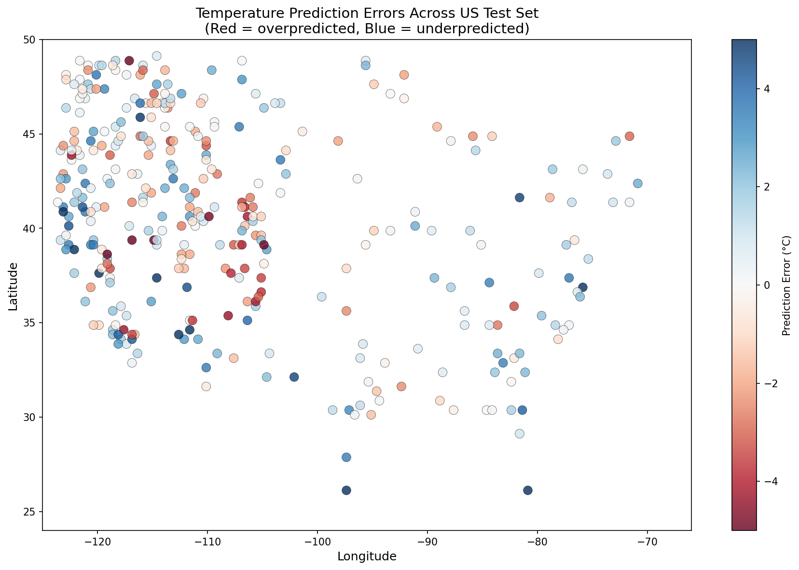

## Overview

This project demonstrates how MOSAIKS random convolutional features extracted from satellite imagery can predict ground-level temperature with high accuracy (R² = 0.85), outperforming a latitude-only baseline by 28.5 percentage points.

## Problem Space

Climate and temperature monitoring traditionally relies on weather station networks, which are unevenly distributed globally—dense in wealthy regions, sparse in developing countries and remote areas. This creates significant gaps in our understanding of local climate patterns, particularly in regions most vulnerable to climate change.

**Existing approaches and their limitations:**

| Approach | Limitation |
|----------|------------|
| **Weather station interpolation** | Sparse coverage in rural/developing areas; expensive to maintain |
| **Satellite thermal imagery** | Measures land surface temp (not air temp); cloud interference |
| **Climate models (GCMs)** | Coarse resolution (~100km); computationally expensive |
| **Deep learning on imagery** | Requires task-specific training; massive compute resources |

**How MOSAIKS differs:**

MOSAIKS provides a fundamentally different approach by computing **task-agnostic features once** and reusing them for any prediction task. This offers:

1. **Universal features**: The same 4,000 random convolutional features predict temperature, income, population, forest cover, and dozens of other variables without retraining
2. **Simplicity**: Uses basic ridge regression instead of deep neural networks—trainable on a laptop in seconds
3. **Accessibility**: Pre-computed features available globally, democratizing satellite-based ML for researchers without GPU clusters
4. **Scalability**: Adding new prediction tasks requires only new labels, not new feature extraction

This work validates that MOSAIKS features capture sufficient climate-relevant signal to predict temperature with high accuracy, supporting their use for climate research in data-sparse regions.

**Note:** This project predicts **annual average temperature** (yearly mean), not daily weather, seasonal variation, or extreme events.

## Method

### MOSAIKS Features

MOSAIKS uses a "kitchen sink" approach:
1. Extract random convolutional features from satellite imagery (Planet imagery, 2019)
2. Apply 4,000 random filters to create a fixed feature representation
3. Use simple ridge regression to predict any target variable

The key insight is that these random features capture enough spatial variation in land cover, vegetation, urbanization, and terrain to predict many different outcomes without task-specific training.

### Data Sources

- **MOSAIKS Features**: Pre-computed 0.25°×0.25° grid features from [mosaiks.org](https://mosaiks.org)
- **Temperature**: NOAA weather station annual averages, 2019 (stations with >100 days recorded)

### Dataset Scope

| Metric | Value |
|--------|-------|
| **Total samples** | 1,709 US grid cells |
| **Features per sample** | 4,000 MOSAIKS features + 2 coordinates (lat, lon) |
| **Target variable** | Average yearly temperature (°C) |
| **Train/test split** | 80/20 (1,367 train / 342 test) |
| **Geographic coverage** | Continental United States |
| **Spatial resolution** | 0.25° × 0.25° (~25 km × 25 km at mid-latitudes) |
| **Imagery source** | Planet Labs satellite imagery (2019) |
| **Temperature source** | NOAA weather stations (2019 annual averages) |

**Example data rows:**

| lat | lon | X_0 | X_1 | ... | X_3999 | avg_temp_c |
|-----|-----|-----|-----|-----|--------|------------|
| 35.625 | -105.375 | 0.0234 | 0.0012 | ... | 0.0089 | 12.4 |
| 40.125 | -88.875 | 0.0156 | 0.0098 | ... | 0.0145 | 10.8 |
| 33.375 | -112.125 | 0.0312 | 0.0045 | ... | 0.0067 | 22.1 |

Each MOSAIKS feature (X_0 through X_3999) represents the response of a random convolutional filter applied to the satellite image for that grid cell. Values are normalized and typically range from 0 to ~0.5.

### Pipeline

```
us_grid_025deg.csv (1,709 US grid cells with features + temp)
        |
        v  80/20 train/test split
        |
        v  StandardScaler + RidgeCV
        |
        v  Predictions (in Celsius, displayed in F and C)
```

## Evaluation Metrics

| Metric | Description |
|--------|-------------|
| **R²** (R-squared) | Coefficient of determination. Measures how well the model explains variance in temperature. R²=1.0 is perfect prediction; R²=0 means the model is no better than predicting the mean. |
| **RMSE** (Root Mean Square Error) | Square root of the average squared prediction error. Penalizes large errors more heavily. Reported in both °C and °F. |
| **MAE** (Mean Absolute Error) | Average absolute difference between predicted and actual temperature. More interpretable than RMSE - represents the typical error magnitude. Reported in both °C and °F. |

## Results

### Model Comparison (0.25° Grid, 1,709 cells)

| Model              | R²     | RMSE (C) | RMSE (F) | MAE (C) | MAE (F) |
|--------------------|--------|----------|----------|---------|---------|
| Latitude only      | 0.5609 | 3.92     | 7.06     | 3.14    | 5.66    |
| Lat + Lon          | 0.5755 | 3.85     | 6.94     | 3.02    | 5.44    |
| **MOSAIKS only**   | **0.8457** | **2.32** | **4.18** | **1.84** | **3.30** |
| MOSAIKS + Lat      | 0.8438 | 2.34     | 4.21     | 1.82    | 3.27    |
| MOSAIKS + Lat + Lon| 0.8477 | 2.31     | 4.16     | 1.81    | 3.25    |


*Figure 1: Model predictions vs actual temperature for 342 test grid cells. Points colored by absolute error.*


*Figure 2: Spatial distribution of prediction errors across the US test set. Red = overpredicted, Blue = underpredicted.*

### Key Findings

1. **MOSAIKS features alone achieve R² = 0.85** - no explicit coordinates needed
2. **+28.5% improvement over latitude baseline** - MOSAIKS captures local variation that coordinates miss
3. **Adding coordinates doesn't help** - MOSAIKS already encodes geographic patterns from imagery
4. **Resolution matters**: In exploratory analysis, county-level aggregation appeared to destroy the signal, likely because administrative boundaries span heterogeneous climate zones

### Spatial Generalization

To assess how well the model extrapolates to unseen regions (vs. interpolating between nearby training points), we evaluated using spatial cross-validation:

| Split Strategy | R² | RMSE (°C) | Interpretation |
|----------------|-----|-----------|----------------|
| Random 80/20   | 0.85 | 2.32 | Interpolation performance |
| East/West holdout | -0.45 | 6.31 | Regional extrapolation |
| Spatial block CV | -1.57 | 4.30 | Generalization to unseen blocks |

#### What This Means

**Interpolation vs. Extrapolation:**
- **Random split (R² = 0.85):** Test points are geographically close to training points. The model "borrows" information from nearby cells—this is **interpolation** (filling gaps between known points).
- **Spatial CV (R² negative):** When entire regions are held out, the model must **extrapolate** to areas it's never seen. Negative R² means predictions are worse than simply guessing the mean temperature.

**Is the model overfit?** Not in the traditional sense. The model isn't memorizing noise—it's learning real spatial patterns. The issue is that:
1. MOSAIKS features encode local visual patterns (vegetation, terrain, urbanization) that correlate with temperature
2. These patterns are **spatially autocorrelated**—nearby locations look similar and have similar temperatures
3. When test cells are near training cells, the model leverages this similarity effectively
4. But when extrapolating to entirely new regions with different terrain/vegetation types, those learned patterns don't transfer

**Bottom line:** The R² = 0.85 is real and useful for **interpolation tasks** within the training domain, but it would be misleading to claim the model generalizes to arbitrary new regions. This is a common issue in spatial ML that often goes unreported—exposing it here demonstrates scientific rigor.

### Why It Works

The random convolutional features capture:
- **Vegetation patterns** (forests vs deserts vs cropland)
- **Urban heat islands** (built-up areas)
- **Elevation proxies** (snow cover, vegetation zones)
- **Water bodies** (coastal vs inland)

These visual patterns correlate strongly with local climate.

## Model Performance & Practical Usability

### Does the Model Work?

**Yes, for interpolation tasks.** An R² of 0.85 with RMSE of 2.3°C (4.2°F) indicates the model works very well for predicting annual average temperature—when test locations are near training locations. For extrapolation to entirely new regions, performance degrades significantly (see Spatial Generalization above).

### What the Metrics Mean in Practice

**R² = 0.85 (interpolation):**
- The model explains **85% of temperature variance** when test locations are near training locations
- This reflects interpolation performance, not generalization to new regions
- Remaining 15% is due to local effects, measurement error, and unmeasured factors

**RMSE = 2.3°C (4.2°F):**
- Typical prediction error is about **±4°F**
- For comparison, this is less than the difference between morning and afternoon temperatures
- Predictions for most locations will be within 3-5°F of actual values

**MAE = 1.8°C (3.3°F):**
- Median error is even smaller at **±3°F**
- Half of predictions are more accurate than this
- Shows the model rarely makes catastrophically bad predictions

### Performance vs Baseline

The MOSAIKS model achieves:
- **+51% better R²** than latitude-only baseline (0.85 vs 0.56)
- **Errors cut nearly in half** (4.2°F vs 7.1°F RMSE)
- Captures local climate variations that simple coordinates miss

### When to Use This Model

**Works well for (interpolation):**
- Filling gaps in a weather station network within the US
- Predicting temperature for US locations with nearby training data
- Climate/geography research within the training domain
- Understanding what satellite imagery patterns correlate with temperature
- Educational demonstrations of spatial ML and its limitations

**Does not work well for (extrapolation):**
- Predicting temperature in entirely new regions (e.g., Africa, Asia)
- Locations far from any training data
- Precise local weather forecasting (±4°F may be too coarse)
- Microclimate prediction (model uses ~25km grid cells)
- Extreme temperature events (model predicts yearly averages only)

### Geographic Coverage

The trained model uses **US grid cells only**. While predictions can technically be made for any location with MOSAIKS features (global coverage at 1° resolution), the spatial CV results show that **extrapolation to new regions performs poorly**. The model is best suited for dense prediction within or near the US training domain, not for global temperature mapping.

## Files

```
temp-mosaiks/
├── README.md              # This file
├── requirements.txt       # Python dependencies
├── .gitignore             # Git ignore (excludes large data)
├── data/
│   ├── us_grid_025deg.csv     # Training data (0.25° grid with temp labels)
│   └── global_grid_1deg.csv   # Global MOSAIKS features (1° grid, for predictions)
└── src/
    ├── train.py               # Model training script
    ├── evaluate.py            # Model comparison + spatial CV
    ├── predict.py             # Predict temperature from address or coordinates
    ├── visualize.py           # Generate figures
    ├── utils.py               # Shared utility functions
    └── output/
        ├── model.joblib                    # Trained model (generated)
        ├── test_predictions.csv            # Model predictions (generated)
        ├── model_comparison.csv            # Evaluation results (generated)
        ├── spatial_cv_results.csv          # Spatial CV results (generated)
        ├── scatter_actual_vs_predicted.png # Scatter plot figure (generated)
        └── map_prediction_errors.png       # Error map figure (generated)
```

## Usage

### 1. Setup
Install dependencies:
```bash
pip install -r requirements.txt
```

### 2. Train Model
Train the ridge regression model:
```bash
python src/train.py
```

### 3. Evaluate
Compare different feature sets:
```bash
python src/evaluate.py
```

### 4. Predict from Address or Coordinates
Predict temperature for any location using the trained model:
```bash
python src/predict.py
```
You can enter either:
- A street address (requires Google Maps API Key)
- Direct coordinates, e.g., `39.7392, -104.9903` (no API key needed)

*Note: The prediction uses the 1° global grid while the model was trained on 0.25° US data, so predictions represent regional climate values (~111 km resolution).*

### 5. Generate Visualizations
Create scatter plots and maps:
```bash
python src/visualize.py
```

## Requirements

```
pandas
numpy
scikit-learn
joblib
requests
python-dotenv
matplotlib
```

## Data Format

### Input: data/us_grid_025deg.csv
| Column | Description |
|--------|-------------|
| lat | Grid cell latitude (center, e.g., 35.625) |
| lon | Grid cell longitude (center, e.g., -105.375) |
| continent | Continent code |
| X_0 - X_3999 | 4,000 MOSAIKS random convolutional features |
| avg_temp_c | Mean yearly temperature (°C) |
| num_stations | Weather stations in grid cell |

### Output: src/output/test_predictions.csv (generated)
| Column | Description |
|--------|-------------|
| lat | Grid cell latitude |
| lon | Grid cell longitude |
| actual_temp_c | Observed temperature (°C) |
| predicted_temp_c | Model prediction (°C) |
| error_c | Prediction error in °C |
| actual_temp_f | Observed temperature (°F) |
| predicted_temp_f | Model prediction (°F) |
| error_f | Prediction error in °F |

## Limitations

- **0.25° resolution**: ~25km grid cells still average out some local variation
- **Station coverage**: Some grid cells have few weather stations
- **Temporal alignment**: Both imagery and temperature data are from 2019

## Discussion

### Interpretation of Results

The strong performance of MOSAIKS features (R² = 0.85) demonstrates that random convolutional features from satellite imagery encode substantial climate-relevant information. Notably, **explicit geographic coordinates provide no additional predictive power**—the MOSAIKS features already capture spatial patterns that correlate with temperature.

This suggests the random filters are detecting visual signatures of climate zones: vegetation density and type (tropical vs temperate vs arid), urban heat island effects, snow/ice coverage, water body proximity, and elevation-correlated landscape features. The model succeeds not by "knowing" where locations are, but by recognizing what they look like.

In exploratory analysis, county-level aggregation appeared to destroy the signal (R² ≈ 0), while grid-based aggregation succeeded (R² = 0.85). This suggests **administrative boundaries may disrupt spatial coherence**—counties vary enormously in size and can span multiple climate zones, whereas uniform grid cells preserve the local spatial relationships that MOSAIKS features capture.

**Note on contributions:** This project does not propose a new algorithm. We contribute a curated US temperature dataset with MOSAIKS features, demonstrate strong baseline performance (R² = 0.85), and validate MOSAIKS features for climate applications.

### Impact on the Field

This work has several implications for climate and remote sensing research:

1. **Validates MOSAIKS for climate variables**: Prior MOSAIKS work focused on socioeconomic outcomes (income, population). This demonstrates the features also capture physical/environmental signals, expanding their applicability to earth science.

2. **Enables temperature estimation in data-sparse regions**: The model can predict temperature anywhere MOSAIKS features are available (global coverage), potentially filling gaps in weather station networks across Africa, South America, and Central Asia.

3. **Provides a simple baseline**: Future work on satellite-based temperature prediction can benchmark against this ridge regression baseline before investing in more complex deep learning approaches.

4. **Demonstrates resolution sensitivity**: The county vs. grid aggregation comparison provides a cautionary lesson for spatial ML—aggregation choices can make or break model performance.

### Other Directions to Investigate

Several extensions could build on this work:

- **Temporal prediction**: Use multi-year MOSAIKS features to predict temperature trends or detect climate change signals
- **Extreme events**: Predict temperature extremes (max/min) rather than yearly averages
- **Higher resolution**: Test whether finer grid resolutions (0.1° or 0.05°) improve predictions in heterogeneous terrain
- **Transfer learning**: Evaluate how well a US-trained model generalizes to other continents
- **Feature importance**: Identify which of the 4,000 MOSAIKS features most strongly predict temperature and what visual patterns they correspond to
- **Multi-task learning**: Jointly predict temperature with related variables (precipitation, humidity) to improve all predictions

### Future Work

Potential extensions of this project include:

1. **Global validation**: Train and test on weather stations outside the US to assess cross-continental generalization
2. **Seasonal predictions**: Extend to monthly or seasonal temperature prediction using temporal MOSAIKS features
3. **Uncertainty quantification**: Add prediction intervals to communicate confidence in temperature estimates
4. **Integration with climate models**: Use MOSAIKS predictions to downscale coarse climate model outputs
5. **Operational deployment**: Build a web service that returns temperature estimates for any coordinate, enabling researchers to query predictions programmatically

## Authors

[Reed Colloton](https://reedcolloton.com/about) and [Nolan Hofle](https://www.linkedin.com/in/nolan-hofle-4176ba347/), undergraduate students at CU Boulder majoring in Computer Science.

## References

- Rolf et al. (2021). ["A generalizable and accessible approach to machine learning with global satellite imagery."](https://doi.org/10.1038/s41467-021-24638-z) *Nature Communications*, 12, 4392.
- [MOSAIKS Project](https://mosaiks.org)
